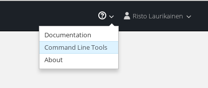

# Exercise 0 - Logging in

## Prerequisites

None.

## Learning objectives

* Logging in using the `oc` tool
* Creating a new project from the commmand line

## Description

In this exercise you will learn how to establish a login session to OpenShift
using the `oc` command line tool.

## Steps

1. Login to the OpenShift web UI

2. Navigate to the "Command Line Tools" page. You can find the link in the top
   right corner once you are logged in:

   

3. If the `oc` tool is not already installed on your computer, you can find a
   link to the releases on the "Command Line Tools" page. Looks for 'Download oc'.
   Install `oc` if needed. It should be a simple binary that you can just 
   drop in your PATH. To add shell completion support, see `oc completion -h`.

4. Copy the login command from the page and paste it into a terminal. You can
   get login status with the `oc status` command.

5. Create a new project and give it a unique name. The name must not have been
   created by any other user of the OpenShift system.
   ```bash
   oc new-project <project name>
   ```
   After running this command, later commands will be in the context of the new
   project.
