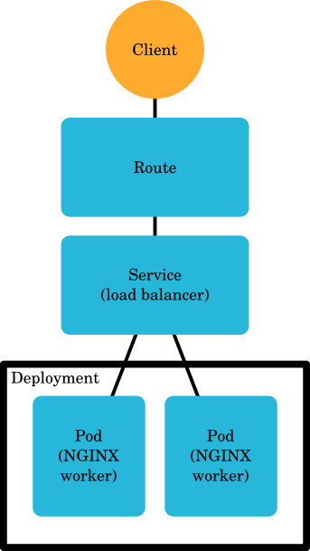

# Exercise 2 - Adding storage, content and scaling up

## Prerequisites

The NGINX instance from exercise 1 is succesfully deployed and accessible via a
browser.

## Learning objectives

* Creating secure **Routes** to a **Service**
* Using persistent storage via **PersistentVolumeClaim** with **Pods**
* Scaling up **Deployments**

## Description

> **Disclaimer:** The method we use to add content to our site in this exercise is
> not something you should do for a real site. Here we simply do it to
> demonstrate the usage of volumes and the `oc rsync` command in a way that is
> hopefully easy to understand if you have some familiarity with web servers.
> For a real site, you should put the content of your site into the container
> images as part of your build process.

Now that we have a basic NGINX web server installation, we should look into
serving some content. We will look at storing data for our website on a
**PersistentVolume** that we will attach to our **Pods**. Since we will have
some real content now, we should make sure the **Route** to our web site is
secure. We will also see how to scale up our site to prepare for more visitors.

The architecture of the resulting app will look like this:



## Relevant documentation

* [Kubernetes: Deployments](https://kubernetes.io/docs/concepts/workloads/controllers/deployment/)
* [Kubernetes: Persistent volumes](https://kubernetes.io/docs/concepts/storage/persistent-volumes/)
* [Kubernetes: Services](https://kubernetes.io/docs/concepts/services-networking/service/)
* [OpenShift: Routes](https://docs.openshift.org/3.6/architecture/networking/routes.html)
* [OpenShift: Copying Files to or from a Container](https://docs.openshift.org/latest/dev_guide/copy_files_to_container.html)

## Steps

1. Before we add our content, let's first make the **Route** to NGINX secured by
   TLS. You can replace (`oc replace`) your existing **Route** using the
   `nginx-tls-route.yaml` file found in the directory for this exercise. You can
   compare the new **Route** definition with the old one to see what's changed:
   ```bash
   diff -u ex1/nginx-route.yaml ex2/nginx-tls-route.yaml
   ```

2. If you access the URL from the **Route** again, you'll be redirected to a
   secure version of the NGINX site. Have a look at the certificate information
   in your browser to get a clue into how this is implemented.

3. Create a **PersistentVolumeClaim** using the `web-content-pvc.yaml` file:
   ```bash
   oc create -f web-content-pvc.yaml
   ```
   Notice the "ReadWriteMany" access mode. This makes it possible to attach the
   same volume to multiple **Pods** at the same time. If the access mode was
   "ReadWriteOnce" instead, the volume would only be attachable to one **Pod**
   at a time. The supported access modes depend on the underlying storage. For
   this exercise, the underlying storage needs to support "ReadWriteMany".

4. Watch the **PersistentVolumeClaim** listing to see when the new claim enters
   the **Bound** state and is ready for use (the handy -w flag can be used with
   other commands as well):
   ```bash
   oc get pvc -w
   ```

5. Update the NGINX **Deployment** to attach the newly created volume to the
   **Pods**. Let's use `oc patch` this time to see how that works:
   ```bash
   oc patch deployment nginx-deployment -p "$(cat nginx-deployment-persistent.yaml)"
   ```
   This will amend the existing **Deployment** so that storage is added to each
   **Pod**. It will only touch the parts of the API object that are relevant.

6. If you look at the NGINX URL now, you should see "403 Forbidden" since there
   is no index page and directory listings are not allowed. This is because we
   have just replaced the content of the default html directory with an empty
   volume.

7. Hang on, we got an error from our site. All our **Pods** are in a bad state,
   yet if you run `oc get pods` they all seem to be running normally. This is
   because we have not defined a *livenessProbe* and a *readinessProbe* for the
   **Pods**. Let's do that next, starting with a *livenessProbe*:
   ```bash
   oc patch deployment nginx-deployment -p "$(cat nginx-livenessprobe.yaml)"
   ```
   Here we define a check to see if someone is answering to TCP connections in
   the port configured in the *containerPort* setting of the **Pod**.

8. If you look at the output of `oc get pods` now, you'll see the **Pods** are
   still reported as running normally. This is because the *livenessProbe* only
   checks to see if it can access the web server at all. To know if the web
   server is ready to serve traffic, we also need a *readinessProbe*:
   ```bash
   oc patch deployment nginx-deployment -p "$(cat nginx-readinessprobe.yaml)"
   ```
   Here we define an HTTP check that expects an HTTP status code between 200
   (inclusive) and 400 (exclusive).

9. After applying the *readinessProbe*, run `oc get pods -w` to watch a new
   deploy take place. You will see that a new **Pod** is created, but it is
   marked as not ready ("READY 0/1"). This is the *readinessProbe* doing its
   job. Let's add some content that will make the web server report a non-error
   status code so that the *readinessProbe* succeeds.

10. Deploy your fancy new website using `oc rsync` on one of the **Pods** using
    content from the html subdirectory of the exercise directory:
    ```bash
    # Get a name for one of the Pods
    oc get pods
    # Copy over the html/ dir to the Pod
    oc rsync html/ <pod name>:/usr/share/nginx/html/
    # Now look at the status of your pods
    oc get pods -w
    ```

11. You should now have some content that was very expensive to create on your
    web page!

12. This new content is sure to bring hordes of interested visitors to the site,
    so let's scale up the **Deployment** to accommodate for the increased
    traffic:
    ```bash
    oc scale --replicas=4 deployment nginx-deployment
    ```
    After running this, there will be four **Pods** running instead of two.

13. Finally, have a look at what the **Deployment** looks like now after all
    these additions:
    ```bash
    oc get deployment nginx-deployment -o yaml
    ```
    You should see the storage and the probes you added. You should also see
    that the size of the **ReplicaSet** is now four.
