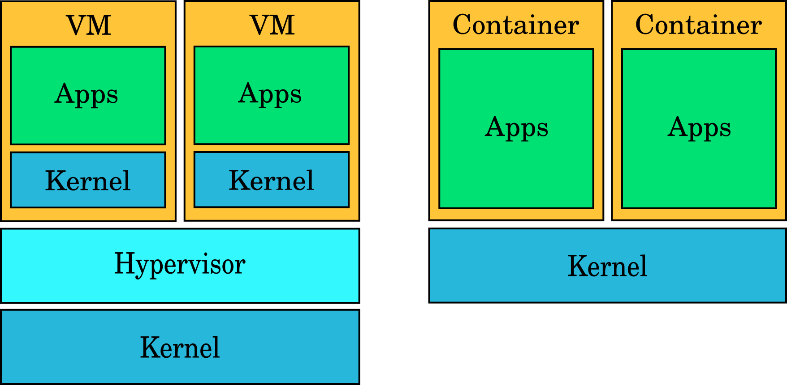

# Docker container orchestration with OpenShift

---

## What are containers?

---

<!-- .slide: data-background="img/old-time-cargo.jpg" -->

---

<!-- .slide: data-background="img/old-time-cargo-2.jpg" -->

---

<!-- .slide: data-background="img/modern-cargo.jpg" -->

---

<!-- .slide: data-background="img/train-cargo.jpg" -->

Note:

* Image source: https://commons.wikimedia.org/wiki/File:CN_2416_GE_C40-8M.jpg
* Author: Nate Beal
* License: [CC BY 2.0](https://creativecommons.org/licenses/by/2.0/deed.en)

---

<!-- .slide: data-background="img/truck-cargo.jpg" -->

Note:

* Image source: https://commons.wikimedia.org/wiki/File:Intermodal_Transport_by_Truck.JPG
* Author: Joseph Madden (Joedamadman)
* License: [CC BY 3.0](https://creativecommons.org/licenses/by/3.0/deed.en)

---

## Containers

* Standardize software deployment
* Build once, run anywhere
* Everything needed to run an app in a single package

---

## Containers in Linux

* A container shares its kernel with its host and other containers, but can have its own
  * File systems
  * Networking stack
  * Resource quota
  * User IDs
  * Process tree
  * etc.
* Can mix and match different isolation features of the kernel

---

## What containers enable

* Programs with conflicting requirements can run on the same server
* Packaging into images
* Security hardening
* Run "Ubuntu" on CentOS or vice versa

---

## Containers
## ≠
## light weight virtual machines

---



---

## Containers
## ≠
## Docker

---

## What is Docker?

* Product from Docker Inc.
* Provides an **abstraction layer** for kernel container features
* Main features
   * Runtime for containers (runC)
   * Image format for containers
   * CLI for running and managing containers and images
   * Dockerfile files for building images

---

### Alternatives

* rkt
* Intel Clear Containers
* LXC
* Singularity (mainly for HPC)

---

## Docker registries

* A Docker **registry** is a server that stores Docker images
* The default one when using Docker's CLI is the **Docker Hub**
* There are many others: quay.io, AWS EC2 Container Registry, Google Container Registry
* You can host one yourself, too

---

### Docker commands

**Run** container:
```
docker run -it ubuntu
```
**List** running containers:
```
docker ps
```

---

### Docker commands

**Pull** container image from a **registry**:
```
docker pull ubuntu
```
**Tag** container image:
```
docker tag docker.io/alpine my-registry.example.com/alpine
```
**Push** container image to private registry:
```
docker push my-registry.example.com/alpine
```
**Build** container image from Dockerfile:
```
docker build . -t my-image:latest
```

---

## Demo

[https://labs.play-with-docker.com](https://labs.play-with-docker.com)

You can follow along on your own computer if you have Docker Hub credentials.

Note:
```
mkdir starwars
vim Dockerfile

FROM alpine

ENTRYPOINT [ "/usr/bin/telnet", "towel.blinkenlights.nl" ]

docker build . -t starwars:latest
docker images
docker run -it --detach --name starwars starwars
docker ps
clear
docker attach starwars
```
