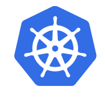

# Container management systems

<!-- .slide: data-background="img_theme/topic_background.png" -->

---

 
 

## Containers ≠ happiness

If run manually, you are tempted to start treating containers
as pets. To herd the cattle, we need a management system.

---

## Docker Swarm

* From Docker Inc.
* Takes care of 
  * scheduling containers on multiple hosts
  * networking, storage (to an extent)
* Bundled to Docker 1.12 and up 
* Same API as Docker engine -> same tools
* [docs.docker.com/engine/swarm/](https://docs.docker.com/engine/swarm/)
* Docker Platform also [supports Kubernetes](https://www.docker.com/kubernetes)

---

## Kubernetes (K8s)

* From Cloud Native Computing Foundation (CNCF)
* Originally developed by Google, donated 2015
* Now developed by Google, Red Hat, CoreOS, ...
* Open source (Apache License 2.0)
  * [github.com/kubernetes/](https://github.com/kubernetes/)
  * one of the biggest and most active projects in GitHub
  * see [CNCF Blog](https://www.cncf.io/blog/2017/06/05/30-highest-velocity-open-source-projects/)

---

## Kubernetes

* Google Container Engine (GKE) implements K8s API
* Amazon Elastic Container Service (EKS) runs K8s
* Azure Container Service (AKS) runs K8s
* Some notable workloads
  * [GitHub frontend](https://githubengineering.com/kubernetes-at-github/)
  * [Pokémon Go](https://cloudplatform.googleblog.com/2016/09/bringing-Pokemon-GO-to-life-on-Google-Cloud.html)
  * [Philips lightbulbs](https://www.bloomberg.com/features/2017-kubernetes/)
* [kubernetes.io](https://kubernetes.io/)

Note:

The "K" stands for Kubernetes.

---

## Kubernetes

* Currently (Dec 2017) at version 1.8
* Next releases will bring better support for batch workloads
* Several commercial distributions available from
  * CoreOS, Cisco, Canonical, Red Hat... 
  * See [K8s certified distributions](https://kubernetes.io/partners/#dist) 

Note:
* upcoming
  * generic device plugin mechanism
  * CPU pinning/architecture awareness
  * hugepages (maybe in 1.8 already?)

---

## OpenShift

> "Enterprise Kubernetes for Developers"
* From Red Hat
* Open source ([github.com/openshift](https://github.com/openshift))
* Batteries included
  * application templates
  * fairly complete Web UI
  * CI/CD pipelines
* [www.openshift.com](https://www.openshift.com)

---

 
 

## Standing on the shoulders of giants

---

<!-- .slide: data-background="img/openshift_logo.png" -->

---

<!-- .slide: data-background="img/kubernetes_logo.png" -->

---

<!-- .slide: data-background="img/picard_as_locutus.jpg" -->
<!-- (image source: Wikipedia, under fair use) -->

---

## OpenShift versions

* OpenShift Origin
  * community supported
  * run on CentOS-7, Fedora, Atomic Host
* Red Hat OpenShift Container Platform    
  * Red Hat support, runs on supported OS stacks
* OpenShift operated by Red Hat in a public cloud
  * OpenShift Online - shared
  * OpenShift Dedicated    

---

## OpenShift platform development model

* Development is very open
  * https://github.com/openshift/origin/issues
  * https://trello.com/atomicopenshift
* Based on a stable K8s version, a few releases behind from bleeding edge
* Ahead of K8s in some areas
  * security, multitenancy
* RH contributes actively to upsteam K8s releases, then
  later switches to using upstream features in OpenShift

---

## OpenShift releases

* Currently (Dec 2017) 3.7 has just come out
* Up to 1.5 there was two versioning schemes
  * 3.x for commercial
  * 1.x for Origin
* Minor number shows K8s release (3.6 -> 1.6)
* In the future OpenShift could be just K8s extensions
  ([source: commons briefing #98](
  https://blog.openshift.com/openshift-commons-briefing-98-kubernetes-release-1-8-update/))

---

## K8s basic concepts

* Namespace (and OpenShift Project)
  * Isolates resources from other namespaces
  * Services are accessible to Pods in the same namespace
* Pod
  * One or more containers and volumes with a common IP
  * Basic schedulable unit
* Volume
  * persistent or temporary filesystem, attached to a Pod
  
Note:

Just enough to get people through the WebUI hands on. More in 04.

---

## Usage model comparison

* Supercomputer (Taito, Sisu)
  * user launches jobs
  * batch queue system schedules and runs jobs 
* IaaS cloud (Pouta)
  * user launches VMs
  * cloud middleware runs VMs
  * VMs are managed by user through ssh, ansible, ...
* Kubernetes (Rahti)
  * user composes application from containerized building blocks
  * K8s schedules and runs Pods
* OpenShift (Rahti)
  * user points system to a source code repository
  * OpenShift builds, schedules and runs application Pods

---

## Somebody Else's Problem

* Network isolation - SEP
* Container and project isolation - SEP
* Process keepalive - SEP
* Capacity management - SEP
* CI/CD orchestration - SEP
* Service location - SEP
* HA load balancing - SEP
* Storage - SEP
* DNS name for the application - SEP
* Server certificates - SEP
* Authorization for delegating management rights - SEP

---

## OpenShift bonus treats

* Docker registry
  * accessible from outside
* WebUI for Docker registry
* Container resource usage monitoring
  * CPU, memory, network
* Terminal access to running containers
  * no host login required
* Centralized logging

Note:

* terminal access to containers is good for security

---

## Security in OpenShift

* Isolation: based on the Linux kernel
* User ID per project, taken from high range
* No root processes in containers
* Extra process capabilities are dropped
* SELinux contexts per project
* Private network per project

Note:

* ClearContainers: KVM

---

## Comparison to other platforms

|                           | Virtual hosting | IaaS Cloud  | Container cloud   |
| ------------------------- | --------------- | ----------- | ----------------- |         
| **Model**                 | pet VMs         | cattle VMs  | cattle containers |
| **Unit**                  | VM              | VM          | container         |
| **Avail for single unit** | high            | medium      | low               |
| **Automatic recovery**    | yes             | DIY         | yes               |
| **Level of abstraction**  | low             | low         | high              |
| **Ease of scaling**       | low             | medium      | trivial           |
| **Non-Linux workloads**   | yes             | yes         | hard              |
