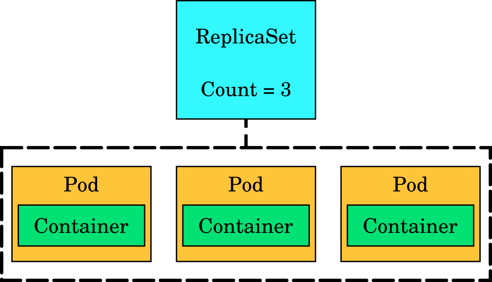

# Terminology

---

### API object

* Described in YAML or JSON
* Represents a single component in a Kubernetes application's architecture
  (like a load balancer or a storage volume)
* Examples:
  * Pod
  * Service
  * Deployment
  * ReplicaSet

---

### Namespace/Project

  * User objects live in their namespaces/projects
  * Services are accessible to Pods in the same namespace
  * Users can have different roles/rights (globally or locally to the namespace)
    * admin, self-provisioner, basic-user, cluster-reader   
  * The admin of a namespace (=you!) can add others as collaborators

---

### Label

* A key value pair like `app: nginx`
* Many things can have a label attached to them
* Can be used for selecting a set of API objects

---

### Pod

A collection of one or more containers and volumes with a common IP.

---

### Pod

* Smallest unit to schedule
* Has resource limits
  * Memory
  * CPU
* Subject to readiness and health checks (per container)

---

### Service

Provides a stable virtual IP and port for a set of pods.

---

### ReplicaSet

Ensure *n* copies of a pod are running.

---

### Deployment

Manages rolling updates.

---

### Route/Ingress

* Provides a way to access Services externally
* Implemented by HAProxy pods ("Routers") in OpenShift
* Maps traffic for a given DNS name to a set of Pods backing a Service
* Optionally terminates TLS

---

## Persistent storage

A **PersistentVolume** stores state. Claimed via **PersistentVolumeClaim**.

---

## Persistent volume
* Global object (lives outside namespaces)
* Can be created by administrators
* Can be created dynamically by Dynamic Volume Provisioning
* Obtained by user by creating a PersistentVolumeClaim  

---

## Persistent volume claim
* Created in project namespace
* properties
  * size
  * access mode (ReadOnly, ReadWriteOnce, ReadWriteMany)
  * storage class
* StorageClass -objects provide a way to select PV properties
  * backed by SSD, backed by spinning rust, mirrored, erasure coded,...

---

### Persistence model

* Pods can use scratch space local to the node it is running on
* **Any data that should persist has to be written to a volume**
* System is free to delete and respawn Pods
* Volume follows Pod when it is rescheduled to a different host

---

## More information

* **[kubernetes.io/docs/concepts/](https://kubernetes.io/docs/concepts/)**
* **[docs.openshift.org/latest/architecture/core_concepts/](https://docs.openshift.org/latest/architecture/core_concepts/)**
