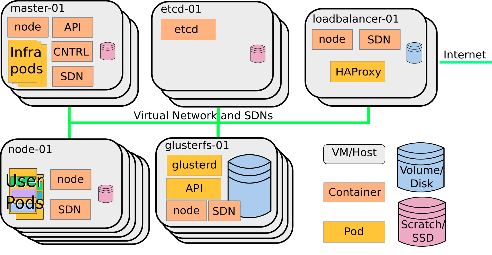

# Kubernetes architecture

---

## K8s architecture
* Master-Slave model
* State in etcd (usually clustered)

---

## K8s principles

> "A controller is a reconciliation loop that drives actual cluster state toward the desired cluster state"

Source: Wikipedia

---

## K8s principles

* Controllers
* Target state
* Current state
* Actions

---

 

## How does our OpenShift deployment look like

---

Note:

* Show description for the cluster we are running on

* Show our deployment pipeline
