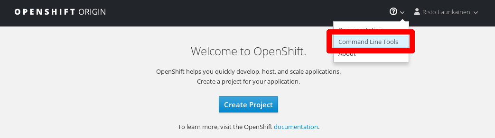

# Hands-on exercises

<!-- .slide: data-background="img_theme/topic_background.png" -->

---

## CLI bootstrap



```
oc login https://<api-url> --token=<token>
oc project <project-name>
oc status
```

---

## Basic commands

Get information:

```bash
# List existing API objects
oc get pods|deployments|services|...
# Get more detailed information about an API object
oc describe pod|deployment|service|... myapiobject
# Get the YAML representation of an API object
oc get pod|deployment|service|... myapiobject -o yaml
```

Create or update:

```bash
# Create an API object from a file
oc create -f somefile.yaml
# Edit an existing API object
oc edit deployment|service|... myapiobject
# Replace API object with an updated one
oc replace -f somefile.yaml
```
