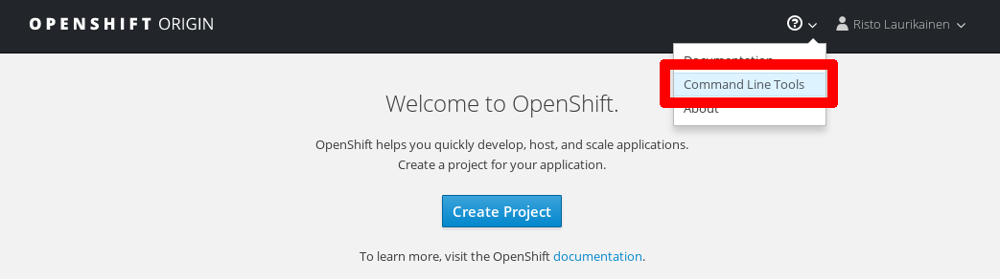

# Hands-on exercises

<!-- .slide: data-background="img_theme/topic_background.png" -->

---

## OpenShift workflow

* Various methods for creating apps
  * Directly from source code directory or Git repo (source-to-image, S2I)
  * From a Docker project based on a Dockerfile (Docker build strategy)
  * Creating API objects one by one from YAML/JSON
* We will look at all of these methods in these exercises

---

## Image restrictions

* Images that require *super user privileges* don't work for normal users in
  OpenShift
* Examples of things that don't work:
  * Binding to low ports (<1024)
  * Running commands as root
* You can often either modify the image or find a readymade alternative image
  that does work with OpenShift
* OpenShift-friendly images can be found here:
  * [Red Hat Container Catalog](https://access.redhat.com/containers/)
  * [CentOS in the Docker Hub](https://hub.docker.com/u/centos/)

---

## CLI bootstrap



```
oc login https://<api-url> --token=<token>
oc project <project-name>
oc status
```

---

## Basic commands

Get information:

```bash
# List existing API objects
oc get pods|deployments|services|...
# Get more detailed information about an API object
oc describe pod|deployment|service|... myapiobject
# Get the YAML representation of an API object
oc get pod|deployment|service|... myapiobject -o yaml
```

Create or update:

```bash
# Create an API object from a file
oc create -f somefile.yaml
# Edit an existing API object
oc edit deployment|service|... myapiobject
# Replace API object with an updated one
oc replace -f somefile.yaml
```

---

## Getting started

* Read the introductory README file in the [exercises directory](https://github.com/Digipalvelutehdas/container-course-material/tree/master/exercises) of the course
  repository
* Clone the course material repository using Git (see instructions in the
  README file)
* Start with exercise 0
